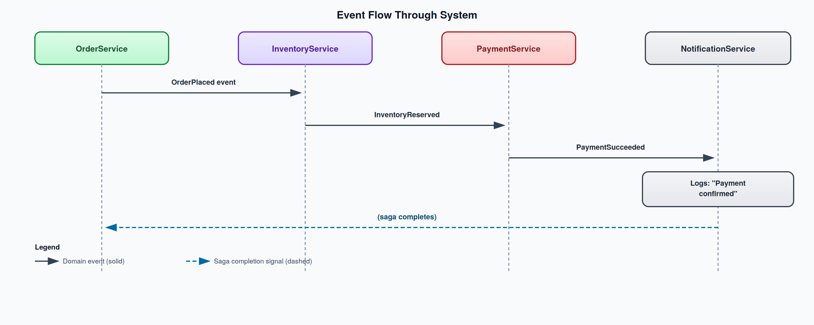

# Shared.Contracts

Shared event contracts and data transfer objects library for the microservices architecture.

## Purpose

Shared.Contracts is a class library that defines the **communication vocabulary** between all services. It contains message contracts (events and commands) and DTOs that every service references, ensuring type-safe, consistent inter-service communication.

## Why Shared Contracts Matter

In a monolith, all services share the same database and type system. In microservices, each service has its own process and data store. Shared.Contracts solves the **interface problem**:

- **Type Safety**: Events are C# records, not magic strings or raw JSON
- **Compile-Time Checking**: If a publisher changes an event shape, consumers get build errors
- **Single Source of Truth**: One definition prevents drift between services
- **MassTransit Integration**: Events implement `IMessage` for type-safe pub/sub

## Architecture

```
Shared.Contracts
├── Events/          # MassTransit IMessage contracts
│   ├── OrderPlaced.cs
│   ├── OrderCancelled.cs
│   ├── InventoryReserved.cs
│   ├── InventoryReservationFailed.cs
│   ├── InventoryLow.cs
│   ├── PaymentSucceeded.cs
│   └── PaymentFailed.cs
├── Products/        # Product DTO
│   └── ProductDto.cs
├── Orders/          # Order DTOs
│   ├── OrderDto.cs
│   └── CreateOrderRequest.cs
├── Inventory/       # Inventory DTO
│   └── InventoryDto.cs
└── Notifications/   # Notification DTO
    └── NotificationDto.cs
```

## Events

All events are immutable C# `record` types implementing MassTransit's `IMessage` interface.

### OrderPlaced

Published by OrderService when a new order is created. Contains full order details including line items with price snapshots.

| Property | Type | Description |
|----------|------|-------------|
| `OrderId` | `Guid` | Unique order identifier |
| `CustomerId` | `Guid` | Customer who placed the order |
| `Items` | `List<OrderItem>` | Line items with `ProductId`, `Quantity`, `UnitPrice` |
| `TotalAmount` | `decimal` | Sum of all line items |
| `PlacedAt` | `DateTime` | ISO 8601 timestamp |

**Consumed by**: InventoryService (reserve stock), NotificationService (send confirmation)

### OrderCancelled

Published when an order is cancelled (inventory failure, payment failure, or customer request). Triggers compensation actions in downstream services.

| Property | Type | Description |
|----------|------|-------------|
| `OrderId` | `Guid` | The cancelled order |
| `CustomerId` | `Guid` | Customer notification target |
| `Reason` | `string` | Cancellation reason |
| `CancelledAt` | `DateTime` | When cancellation occurred |

**Consumed by**: InventoryService (release stock), NotificationService (notify customer)

### InventoryReserved

Published when InventoryService successfully reserves stock for all items in an order. Signals the saga to proceed to payment.

| Property | Type | Description |
|----------|------|-------------|
| `OrderId` | `Guid` | Order this reservation is for |
| `CustomerId` | `Guid` | Customer who placed the order |
| `ReservedItems` | `List<ReservedItem>` | Confirmed reservations with quantities |
| `ReservedAt` | `DateTime` | When reservation was made |

**Consumed by**: OrderService saga (transition to payment state)

### InventoryReservationFailed

Published when InventoryService cannot reserve stock (insufficient quantity). Triggers saga compensation and order cancellation.

| Property | Type | Description |
|----------|------|-------------|
| `OrderId` | `Guid` | Order that couldn't be fulfilled |
| `CustomerId` | `Guid` | Customer to notify |
| `Reason` | `string` | Why reservation failed |
| `FailedAt` | `DateTime` | When failure occurred |

**Consumed by**: OrderService saga (cancel order)

### InventoryLow

Published when a product's available stock drops below the reorder threshold. Used for restocking alerts.

| Property | Type | Description |
|----------|------|-------------|
| `ProductId` | `Guid` | Product with low stock |
| `ProductName` | `string` | Denormalized name for display |
| `CurrentQuantity` | `int` | Current stock level |
| `ReorderThreshold` | `int` | Threshold that was breached |
| `DetectedAt` | `DateTime` | When low stock was detected |

**Consumed by**: NotificationService (send low-stock alert)

### PaymentSucceeded

Published when PaymentService successfully processes a payment. Triggers order completion.

| Property | Type | Description |
|----------|------|-------------|
| `OrderId` | `Guid` | Order this payment was for |
| `CustomerId` | `Guid` | Customer who paid |
| `Amount` | `decimal` | Amount charged |
| `TransactionId` | `string` | Payment provider transaction ID |
| `ProcessedAt` | `DateTime` | When payment was processed |

**Consumed by**: OrderService saga (transition to Completed), NotificationService (send receipt)

### PaymentFailed

Published when a payment fails. Triggers saga compensation (release inventory, cancel order).

| Property | Type | Description |
|----------|------|-------------|
| `OrderId` | `Guid` | Order whose payment failed |
| `CustomerId` | `Guid` | Customer to notify |
| `Amount` | `decimal` | Amount that failed |
| `Reason` | `string` | Why payment failed |
| `FailedAt` | `DateTime` | When failure occurred |

**Consumed by**: OrderService saga (compensate: release inventory, cancel order), NotificationService (notify customer)

## Data Transfer Objects

### ProductDto

Shared between CatalogService (producer) and ApiGateway/OrderService (consumers).

| Property | Type | Description |
|----------|------|-------------|
| `Id` | `Guid` | Product identifier |
| `Name` | `string` | Display name |
| `Description` | `string` | Detailed description |
| `Price` | `decimal` | Current price (snapshot at order time) |
| `StockQuantity` | `int` | Available stock |
| `Category` | `string` | Product category |

### OrderDto

Used in REST API responses across OrderService and ApiGateway.

| Property | Type | Description |
|----------|------|-------------|
| `OrderId` | `Guid` | Unique order identifier |
| `CustomerId` | `Guid` | Customer who ordered |
| `Items` | `List<OrderItemDto>` | Line items with product details |
| `TotalAmount` | `decimal` | Order total |
| `Status` | `string` | Current order status |
| `CreatedAt` | `DateTime` | When order was placed |
| `CompletedAt` | `DateTime?` | When order completed (null if pending) |

### CreateOrderRequest

Sent by ApiGateway to OrderService when a client places an order.

| Property | Type | Description |
|----------|------|-------------|
| `CustomerId` | `Guid` | Customer placing the order |
| `Items` | `List<CreateOrderItemRequest>` | Items to order (ProductId + Quantity) |

### InventoryDto

Represents stock levels for a product, used by CatalogService and InventoryService.

| Property | Type | Description |
|----------|------|-------------|
| `ProductId` | `Guid` | Product identifier |
| `ProductName` | `string` | Display name |
| `AvailableQuantity` | `int` | In-stock quantity |
| `ReservedQuantity` | `int` | Reserved by pending orders |
| `ReorderThreshold` | `int` | Low-stock alert threshold |
| `IsLowStock` | `bool` | Computed: `AvailableQuantity < ReorderThreshold` |

### NotificationDto

Represents a notification sent to a customer.

| Property | Type | Description |
|----------|------|-------------|
| `NotificationId` | `Guid` | Unique notification ID |
| `CustomerId` | `Guid` | Recipient |
| `Type` | `string` | Notification type (e.g., "OrderConfirmed", "PaymentFailed") |
| `Subject` | `string` | Notification subject line |
| `Message` | `string` | Notification body |
| `SentAt` | `DateTime` | When notification was sent |

## MassTransit IMessage Integration

MassTransit is a distributed application framework for .NET. It provides a service bus abstraction that works with RabbitMQ, Azure Service Bus, Amazon SQS, and other transports.

```
[MassTransit PackageReference: 8.2.*]
```

### How IMessage Works

Every event record in Shared.Contracts implicitly implements `IMessage` through MassTransit. This enables:

```csharp
// Publishing (in a service)
await context.Publish(new OrderPlaced { OrderId = orderId, ... });

// Consuming (in another service)
public class OrderPlacedConsumer : IConsumer<OrderPlaced>
{
    public async Task Consume(ConsumeContext<OrderPlaced> context)
    {
        var message = context.Message; // Type-safe!
    }
}
```

### Why MassTransit?

1. **Transport Abstraction**: Same code works with RabbitMQ (dev), Azure Service Bus (prod)
2. **Automatic Serialization**: JSON serialization/deserialization handled by the framework
3. **Consumer Lifecycle**: Automatic retry, error queues, circuit breakers
4. **Saga Support**: State machine framework for distributed workflows
5. **Type-Based Routing**: Messages routed by C# type, not string-based topic names

## Dependencies

- **MassTransit 8.2.x** - Service bus abstraction
- **.NET 8.0** - Target framework

## How Services Reference This

```xml
<!-- In each service's .csproj -->
<ItemGroup>
    <ProjectReference Include="..\Shared.Contracts\Shared.Contracts.csproj" />
</ItemGroup>
```

All services (ApiGateway, CatalogService, OrderService, InventoryService, PaymentService, NotificationService) reference this library.

## Event Flow Through the System



## How to Test

Since Shared.Contracts is a class library, it has no standalone API. Test it through the services that consume it:

```bash
# Verify the library compiles
dotnet build src/Shared.Contracts/
```

Events can be tested by publishing them directly to RabbitMQ using MassTransit's test harness, or by writing unit tests that verify event serialization/deserialization.
